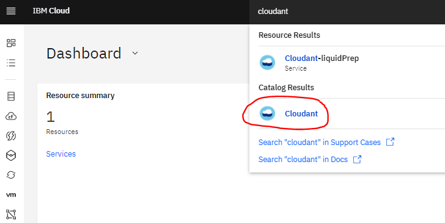
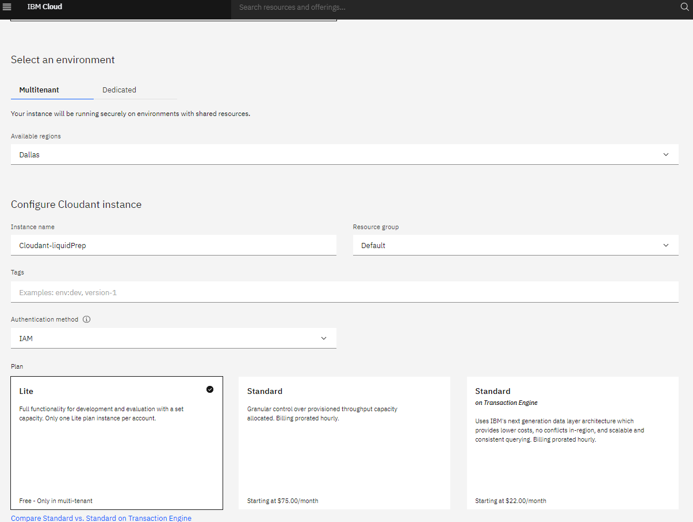
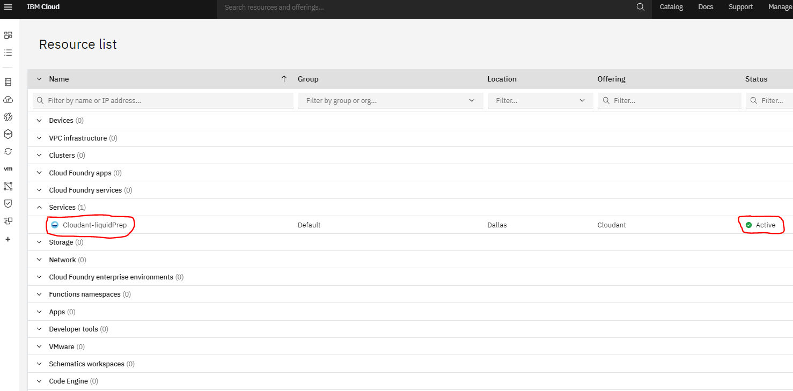
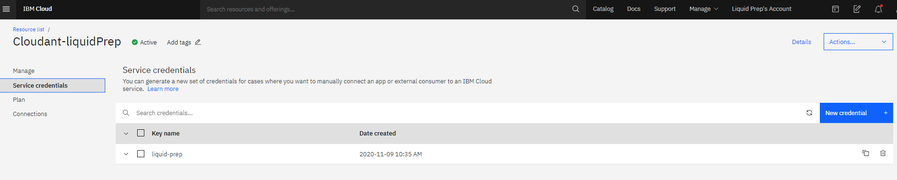
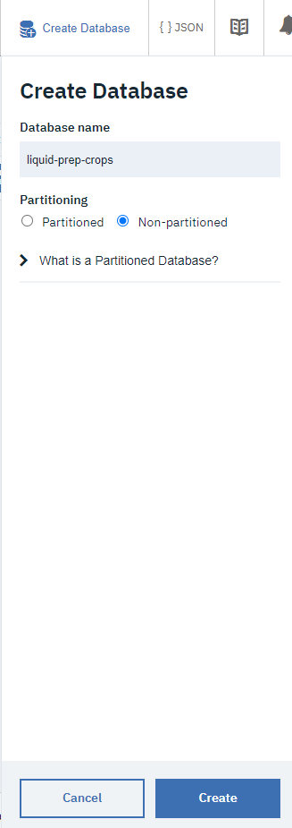
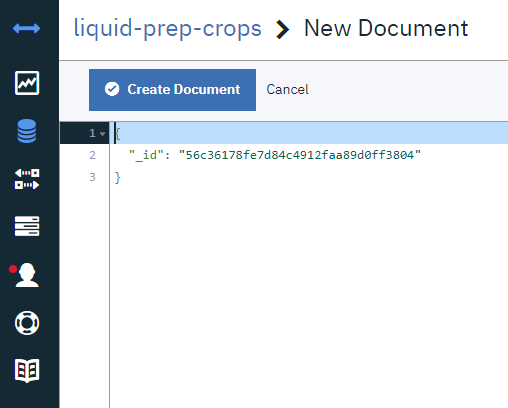
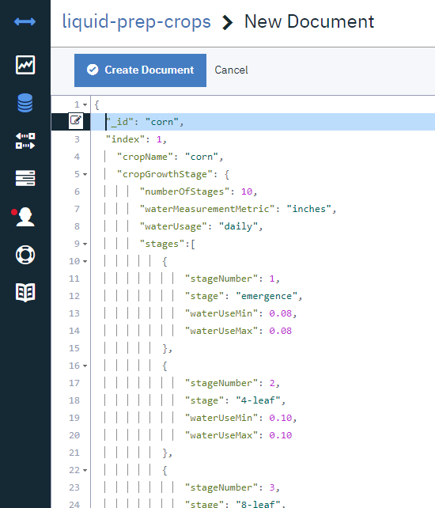
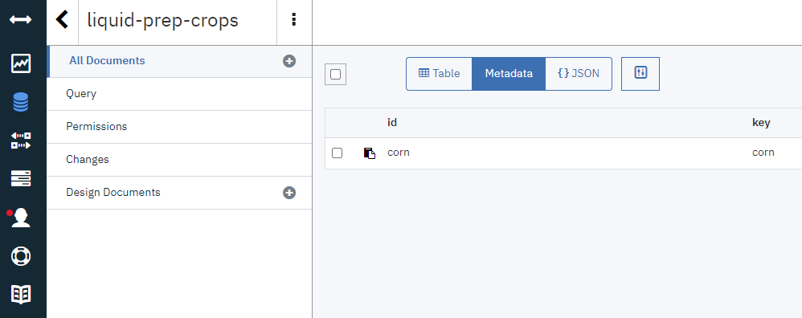

# Setup IBM Cloudant Database

Follow the instructions to setup and configure IBM Cloudant Database on IBM Cloud.

## Pre-requisites

1. **IBM Cloud Account**
   - [Create an IBM Cloud account to setup a Cloudant Database](https://cloud.ibm.com/registration)

## Configure Cloudant Database on IBM Cloud

- Enter **Cloudant** in the IBM Cloud search bar and select **Cloudant**.

  

      
  

- Next configure the Cloudant DB,

  - Under **Select an environment** section, enter Instance Name as **Cloudant-liquidPrep**.

  - Select **IAM** as Authentication method.

  - Select a suitable pricing Plan – Lite, Standard and Standard on Transaction Engine.

  

      
  

- Select **Create** on the bottom right pane of Cloudant dashboard. A message will be displayed to say that the instance is being provisioned, which returns you to the Resource list. From the Resource list, you see the status for your instance is, **Provision in progress.**

  

      
  

- When status of the instance changes to **Active**, click the **Cloudant-liquidPrep** instance and select **Service Credentials** tab on left pane of dashboard. Select **New Credential**, enter Name as **liquid-prep** and Role as **Manager**. A service credential will be created.

  

      
  

- Select **Manage** tab on the left pane and select **Launch Dashboard** on the top right of the page. It will launch a Cloudant dashboard to create new database.

- On the Databases page, select **Create Database** on the top right of the Cloudant dashboard.
- Enter Database name as **liquid-prep-crops**. Select the Partitioning option as **Non-partitioned**. And click on **Create** button at the bottom.

   

       
   

  - The **liquid-prep-crops** database will be created and listed in Databases page.

- Select **liquid-prep-crops** and click on **Create Document** on top right of the page. A document with auto generated **\_id** key will open.

   

       
   

- Go to Liquid Prep project directory `~/LiquidPrep-Node-Backend/resources/crops`. Open each crop document, copy the contents in the document and paste it in the **New Document** that was opened in **liquid-prep-crops** database and click **Create Document** button.

  - Example for Corn crop;
  

      
  

  - Corn document will be created and listed in **liquid-prep-crops** database.
  

      
  

- Similarly, repeat previous step for all the other crop documents.
